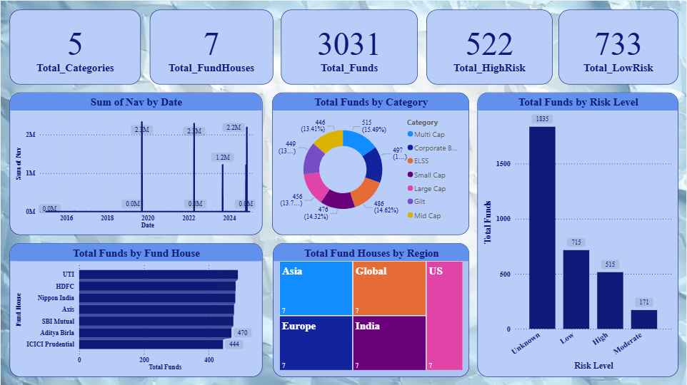

<h1 align="center">💹 Interactive Mutual Fund Analysis Dashboard</h1>

  

---

### 👩‍💻 About the Project

The **Interactive Mutual Fund Analysis Dashboard** is a **Power BI project** developed to analyze and visualize mutual fund data for **performance, efficiency, and category-wise comparison**.  
This dashboard integrates **Power Query for data cleaning**, **DAX for analytical calculations**, and **Python scripts for advanced insights**, offering a holistic view of mutual fund behavior and investment performance.

It highlights **key KPIs** like NAV Growth, AUM, Expense Ratio, Tenure, and Returns — presented through a clean, dynamic, and interactive interface.

---

### 🌐 Live Dashboard

🔗 **Click to Explore:**  
👉 [View the Interactive Power BI Dashboard](https://app.powerbi.com/groups/me/reports/7fe763e6-6fef-4781-9d6d-85d85bbe42a8/0b1fdd6f63f97c9e6705?experience=power-bi)

> *(Best viewed in desktop mode for full interactivity.)*

---

### 🧹 Data Preparation & Cleaning

Data was imported from a structured **CSV dataset** (`Interactive_Mutual_Fund_Dataset.csv`) using **Power Query**.  
The following preprocessing steps ensured clean, reliable, and analysis-ready data:

1. **Data Profiling:** Enabled column quality, distribution, and profiling to detect nulls and anomalies.  
2. **Type Correction:**  
   - Dates → `nav_date`, `launch_date`  
   - Numeric → `aum_crore`, `expense_ratio_pct`, `returns_%`, `folio_count`, `tenure_months`  
   - Text → `scheme_name`, `fund_house`, `category`, `benchmark`  
3. **Cleaning:**  
   - Trimmed and cleaned text fields.  
   - Replaced invalid tokens (“NA”, “nan”, “null”) with blanks.  
   - Removed duplicates and error rows.  
4. **Applied transformations** and loaded data into the Power BI model.

---

### 🧮 Data Model & Schema Design

The project follows a **Star Schema** for optimized querying and visualization performance.

**Tables:**
- **Fact Table:** Mutual Fund performance metrics (NAV, AUM, Returns, Expense Ratio, etc.)  
- **Dimension Tables:** Fund House, Category, Sub-Category, Benchmark, and Date  

Relationships are defined as **one-to-many** between dimension and fact tables to enable slicers and drill-through filters.

---

### 🧾 DAX Measures Used

Custom DAX formulas were created to compute key KPIs and analytical measures across fund categories:

| KPI / Measure | DAX Formula | Description |
|----------------|-------------|--------------|
| **Total AUM** | `SUM(Funds[AUM_Crore])` | Total Assets Under Management |
| **Average NAV** | `AVERAGE(Funds[NAV])` | Mean NAV across selected category |
| **Expense Efficiency** | `DIVIDE([Return %], [Expense Ratio])` | Compares performance vs. cost |
| **Risk Ratio** | `DIVIDE([Return %], [Standard Deviation])` | Measures stability of returns |
| **1-Year CAGR** | `((1 + [Return_1yr_Pct]/100) ^ (1/1)) - 1` | Compound growth over one year |
| **Tenure Bucket** | `SWITCH(TRUE(), [Tenure_Months] < 24, "Short-Term", [Tenure_Months] < 60, "Mid-Term", "Long-Term")` | Categorizes funds by tenure |

Each measure enhances interactivity and comparative analysis across fund categories.

---

### 📊 Dashboard Pages

#### 🔹 Overview Page

  
   <em>Summarized insights of total funds, AUM, returns, and category distribution.</em>

---

#### 🔹 Fund Insights

  
   <em>Focused view of selected funds with simplified visuals after removing redundant charts for clarity.</em>

---

#### 🔹 Drill-through Page

  
   <em>Drill through from summary visuals into specific fund performance details and risk comparisons.</em>

---

#### 🔹 Python Connectivity

  
   <em>Used embedded Python scripts for advanced analytics like outlier detection and regression-based return analysis.</em>

---

### 🧠 Key Insights

- Clear understanding of **fund performance trends** across categories.  
- Identification of **top-performing fund houses** by returns and AUM.  
- Relationship between **Expense Ratio and Returns** analyzed via DAX.  
- **Python integration** enhanced data interpretation through statistical modeling.  
- Simplified user journey through **drill-through filters** and **interactive KPIs**.  

---

### ⚙️ Tools & Technologies

| Category | Tools Used |
|-----------|-------------|
| **Data Visualization** | Power BI |
| **Data Preparation** | Power Query |
| **Modeling & Calculations** | DAX |
| **Scripting** | Python |
| **Data Source** | CSV Dataset |
| **Version Control** | GitHub |

---

### 🧑‍🎓 Author

**Khushanuma Mansuri**  
📍 Passionate Data Analyst & Power BI Enthusiast  
📧 [khushanuma.shabbir@gmail.com](mailto:khushanuma.shabbir@gmail.com)  
🌐 [LinkedIn](https://www.linkedin.com/in/khushanuma-mansuri-7b0789292/)

---

### 🏆 Achievements

- Designed a **4-page interactive Power BI dashboard**.  
- Built an optimized **Star Schema** for smooth data modeling.  
- Developed **custom DAX measures** for fund analysis and risk profiling.  
- Implemented **drill-through and dynamic filtering**.  
- Embedded **Python scripts** for predictive and comparative analysis.  
- Created a **professional, visually appealing** reporting interface for financial insights.

---

### 💎 Badges

---

⭐ *If you found this dashboard insightful, consider giving it a star on GitHub!* ⭐
